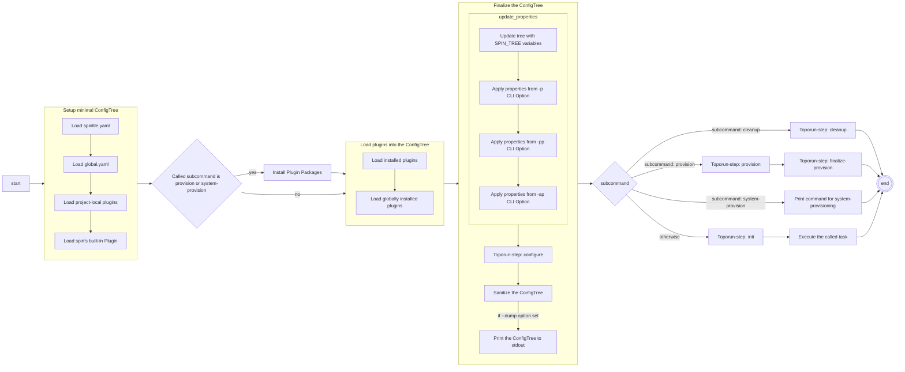

# The Architecture of cs.spin

The following diagram schematically visualizes the action spin performs during a
call using `cleanup`, `provision`, or some other task.

```mermaid
graph LR
start --> load_minimal_tree--> choice1{Called subcommand is provision or system-provision}
end_(((end)))

choice1 --> |yes| install_plugin_packages[Install Plugin Packages] --> load_plugins_into_tree
choice1 --> |no| load_plugins_into_tree

load_plugins_into_tree --> finalize_cfg_tree

finalize_cfg_tree --> choice2{subcommand}

choice2 --> |subcommand: cleanup| toporun_cleanup[Toporun-step: cleanup] --> end_
choice2 --> |subcommand: provision| toporun_provision[Toporun-step: provision] --> toporun_finalize_provision[Toporun-step: finalize-provision] --> end_
choice2 --> |subcommand: system-provision| print_system_provision_cmdline[Print command for system-provisioning] --> end_
choice2 --> |otherwise| toporun_init[Toporun-step: init] --> run_task[Execute the called task] --> end_

    subgraph load_minimal_tree[Setup minimal ConfigTree]
        load_spinfile[Load spinfile.yaml] --> load_global_yaml[Load global.yaml] --> load_local_plugins[Load project-local plugins] --> load_builtin_plugin[Load spin's built-in Plugin]
    end

    subgraph load_plugins_into_tree[Load plugins into the ConfigTree]
        load_plugin_packages[Load installed plugins] --> load_global_plugins[Load globally installed plugins]
    end

    subgraph finalize_cfg_tree[Finalize the ConfigTree]
        subgraph update_properties
        direction TB
            update_config_from_environment[Update tree with SPIN_TREE variables ] --> apply_properties[Apply properties from -p CLI Option] --> apply_prepend_properties[Apply properties from -pp CLI Option] --> apply_append_properties[Apply properties from -ap CLI Option]
        end
        update_properties --> toporun_configure[Toporun-step: configure] --> tree_sanitize[Sanitize the ConfigTree] --> | if --dump option set|dump[Print the ConfigTree to stdout]
    end
```
